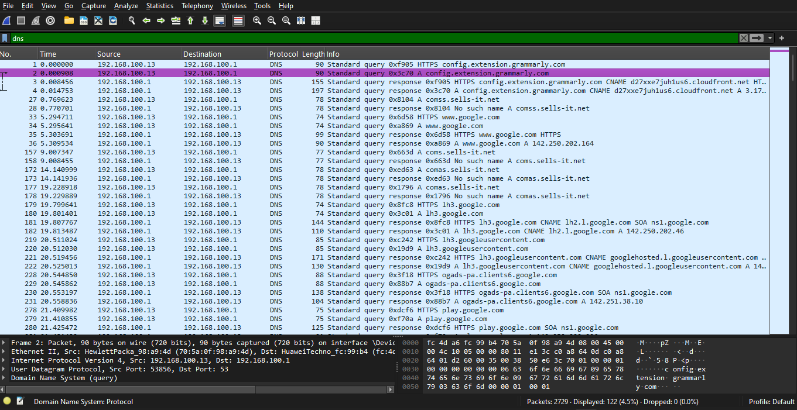
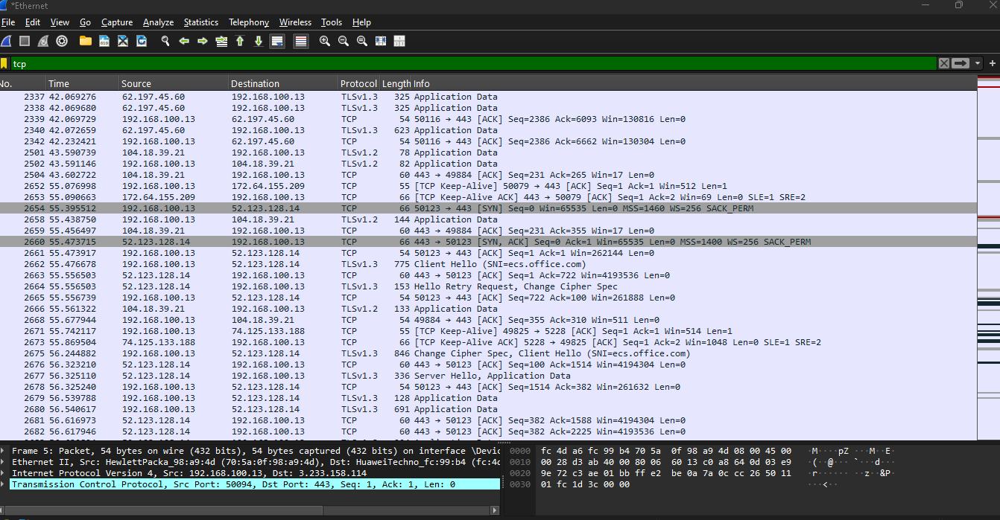
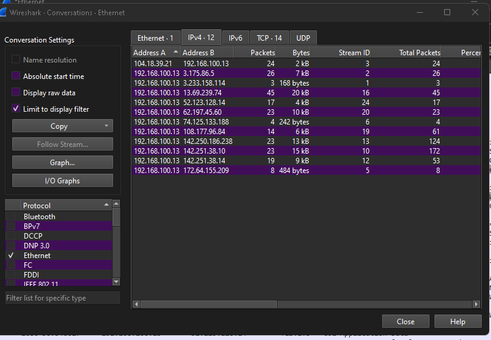
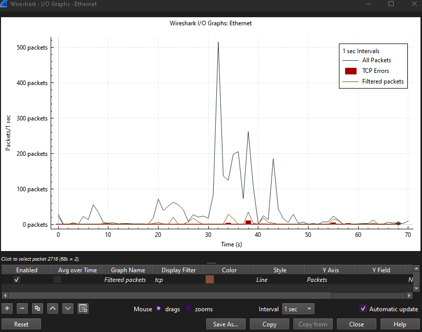

# Wireshark DNS and TCP Analysis (HTTPS: google.com)

## Objective
This project demonstrates capturing and analyzing network traffic using Wireshark. The focus is on DNS resolution, TCP handshake, and HTTPS traffic analysis when visiting google.com. It illustrates how a computer communicates with servers over the network.

## Tools Used
- Wireshark
- Ethernet connection
- Web browser (Chrome/Firefox)

## Capture Process
1. Open Wireshark and select the Ethernet interface.  
2. Start packet capture.  
3. Visit [https://www.google.com](https://www.google.com) in the browser.  
4. Stop capture after the page fully loaded.

## Filters Applied
| Filter | Purpose |
|--------|---------|
| dns | Show domain lookups (google.com → IP) |
| tcp.port | Show HTTPS TCP packets (encrypted traffic) |

## Packet Analysis

### DNS Packet
- **Source IP:**  192.168.100.13
- **Destination IP:** 192.168.100.1
- **Query:** google.com  
- **Answer:** 142.150.190.78

### TCP Handshake
- **Source IP:** 192.168.100.13
- **Destination IP:** 192.168.100.1
- **TCP Flags:** SYN → SYN-ACK → ACK  

### Top Talkers
Shows the IPs your computer communicated with the most during the capture.  

### I/O Graph
Shows packet volume over time while loading google.com.  

## Observations
- DNS resolves google.com to an IP before connecting.  
- TCP handshake establishes a secure connection.  
- HTTPS traffic is encrypted, but packet flow, IPs, and ports show communication patterns.  
- Top Talkers and I/O Graph provide additional insight into network activity and traffic volume.

## Files in Repository
- `tcp-dns-capture.pcapng` → Wireshark capture file  
- PNG files: DNS packet, TCP handshake, Top Talkers, I/O Graph

